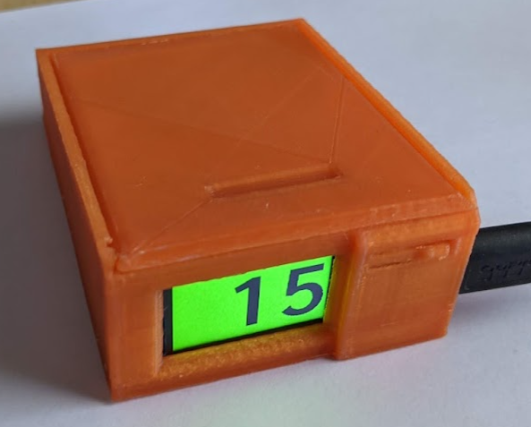
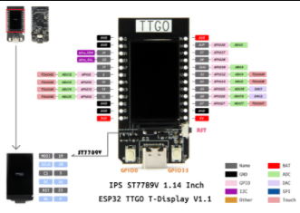
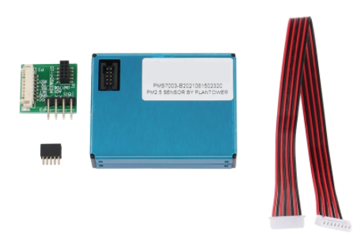

# AQI Display

A small box which will display the **Air Quality Index** based on the US EPA formula, using a $15 sensor and $10 microcontroller and display. As the AQI climbs, the background color changes, matching the colors used on [PurpleAir](https://map.purpleair.com/). The display is a 1.1" TFT, bright enough to be seen in daylight from across a large room.

]

### Features
* 30 seconds of data gathering and averaging of particle count to calculate AQI
* Color changing background based on AQI value
* Displays latest calculated value every minute for the first 10 minutes. Then goes into a **Sleep Mode** to preserve the sensors fan, calculating a new AQI value every 30 minutes.
* Written in micropython, everything is easily configurable.
* Front button to begin gathering on demand
## Assembly

### Parts Required:
1. LILYGO® TTGO T-Display ESP32 [aliexpress](https://lilygo.aliexpress.com/store/2090076/search?SearchText=esp32+t-display)

]

2. Plantower PMS7003 Air Quality Sensor + G7 Adapter [aliexpress](https://www.aliexpress.com/wholesale?trafficChannel=main&d=y&CatId=0&SearchText=pms7003+g7&ltype=wholesale&SortType=total_tranpro_desc&groupsort=1&page=1)

]

### Software

Easiest way to setup the software is to hook up the T-Display to a computer running [Thonny](https://thonny.org/) and follow [these instructions](https://docs.micropython.org/en/latest/esp32/tutorial/intro.html) to flash [this custom firmware](https://github.com/russhughes/st7789_mpy/tree/master/firmware/T-DISPLAY), which includes drivers for writing to the display included with the T-Display device.

Then you can copy to the device all the `*.py` files from this repository and customize them if required.

### Hardware

Attach the G7 Adapter to the sensor. Connect the included adapter cable and cut off the other end to expose the wires. Strip, connect and solder the following connections:

| PMS7003     | T-Display   |
| ----------- | ----------- |
| VCC      | 5V       |
| GND      | G        |
| RX       | 26        |
| TX       | 25        |

The T-Display schematic can be found [here](https://user-images.githubusercontent.com/25242404/79798978-70c1bc80-8362-11ea-89e7-cee3a98e8508.png).

### Case
The components can be taped together quite easily. But if you have access to a 3d printer you can use the included STL files (in the `case/` directory) to print a case and fit the components inside.